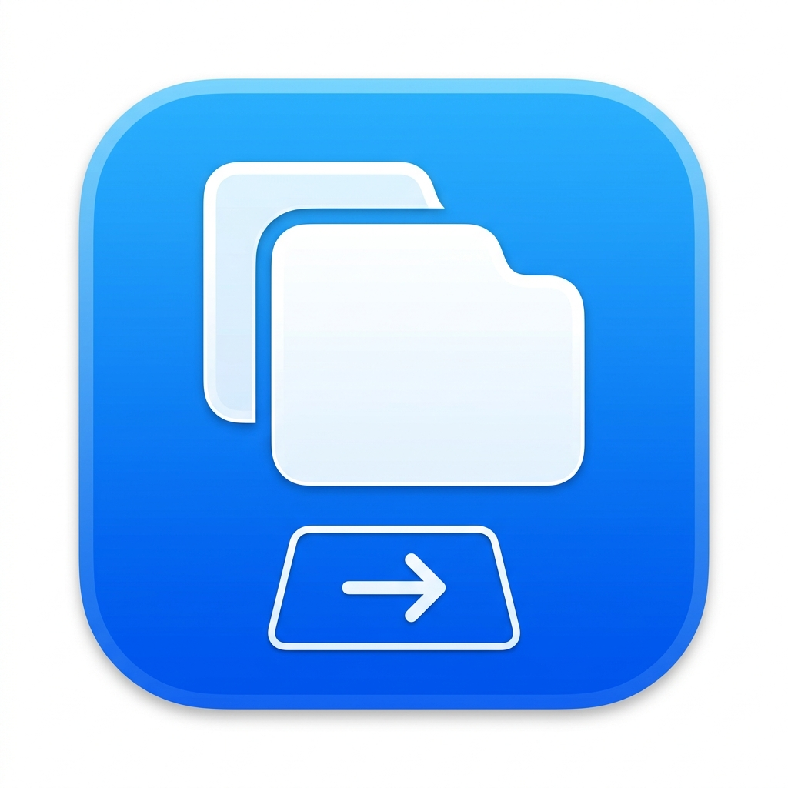

#  SlideTabSafari

A lightweight, background macOS menu-bar application that lets you switch between browser tabs using trackpad gestures. Works with **Safari, Chrome, Brave, Arc, Firefox, Edge**, and more.

---

## Why does this exist?

Natively in macOS, performing a two-finger horizontal swipe in Safari triggers the "Back/Forward" history navigation. SlideTabSafari intercepts the horizontal scrolling at the system level before it reaches the browser, consumes the event so you don't accidentally go back in history, and instead injects native `Control+Tab` shortcuts to quickly navigate through your open tabs.

## Features

- **🌐 Multi-Browser Support** — Works with 10 browsers out of the box: Safari, Chrome, Brave, Arc, Firefox, Edge, Opera, Vivaldi, Safari Technology Preview, and Chrome Canary.
- **⚡ Zero Configuration** — Works out of the box with standard macOS keyboard shortcuts (`Control+Tab`). Layout independent.
- **🔇 Silent & Unobtrusive** — Runs entirely in the background from your Menu bar. No Dock icon, no messy panels.
- **📊 Smart Resource Usage** — Idles with almost 0 CPU usage because it only evaluates `CGEvent` scrolls when a supported browser is currently the active application.
- **🎯 Tab Switch HUD** — Visual overlay showing the direction when switching tabs. Can be toggled on/off.
- **🎚️ Adjustable Sensitivity** — Three levels: Low, Medium, and High, to match your swipe preference.
- **↔️ Swipe Direction** — Toggle between Natural and Standard swipe direction.
- **🚀 Launch at Login** — Automatically starts with your Mac (configurable).
- **👋 First-Launch Onboarding** — A welcome window guides you through setup on the first run.

## Supported Browsers

| Browser | Status |
|---|---|
| Safari | ✅ Supported |
| Safari Technology Preview | ✅ Supported |
| Google Chrome | ✅ Supported |
| Chrome Canary | ✅ Supported |
| Brave | ✅ Supported |
| Arc | ✅ Supported |
| Firefox | ✅ Supported |
| Microsoft Edge | ✅ Supported |
| Opera | ✅ Supported |
| Vivaldi | ✅ Supported |

Each browser can be individually enabled or disabled from the **Browsers** submenu.

## Installation & Building

Since this application intercepts global hardware events, it requires Accessibility permissions. To make this safe and transparent, the application is compiled entirely locally on your machine from a single pure Swift file.

### Prerequisites
- macOS
- Xcode Command Line Tools (Usually already installed. If not, run `xcode-select --install`)

### Building the App
1. Clone this repository:
   ```bash
   git clone https://github.com/Dmian0/SlideTabSafari.git
   cd SlideTabSafari
   ```
2. Run the build script to compile the Swift source and generate the code-signed App bundle (`SlideTabSafari.app`):
   ```bash
   chmod +x build.sh
   ./build.sh
   ```
3. Once compiled, launch the app directly:
   ```bash
   open SlideTabSafari.app
   ```

## Granting Permissions

To intercept trackpad events and simulate keystrokes, macOS requires explicit consent:
1. When you first open the app, it will prompt you for **Accessibility** permissions.
2. Go to **System Settings > Privacy & Security > Accessibility**.
3. Enable the toggle for `SlideTabSafari` in the list.
4. The application handles the rest! You will see a `⇥` icon in your Menu bar.

## Usage
- Open any supported browser with multiple tabs.
- Perform a **two-finger horizontal swipe** on your trackpad.
- The app will seamlessly switch to the adjacent tab instead of navigating the page history.
- A visual **HUD overlay** briefly shows the direction of the switch.
- Click the `⇥` icon in your menu bar to access all settings:
  - Toggle swipe direction
  - Adjust sensitivity
  - Enable/disable the HUD
  - Enable/disable specific browsers
  - Launch at Login
  - Hide the menu bar icon

## How It Works Under The Hood

The app utilizes a `CGEventTap` (`.cghidEventTap`) to observe raw `.scrollWheel` HID events before any application processes them. A `BrowserRegistry` checks whether the frontmost application is a supported, enabled browser. A mini state machine (`GestureTracker`) accumulates horizontal delta values. When the horizontal movement hits a specific threshold, it consumes the trackpad event sequence (returning `nil` in the tap callback) and posts a `CGEvent` keyboard injection (`Control+Tab` or `Control+Shift+Tab`).

## License
[MIT License](LICENSE)
